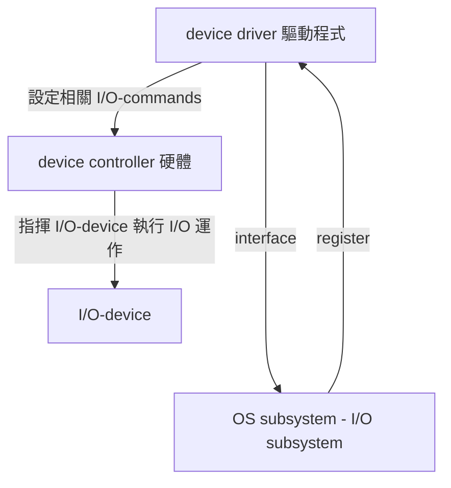
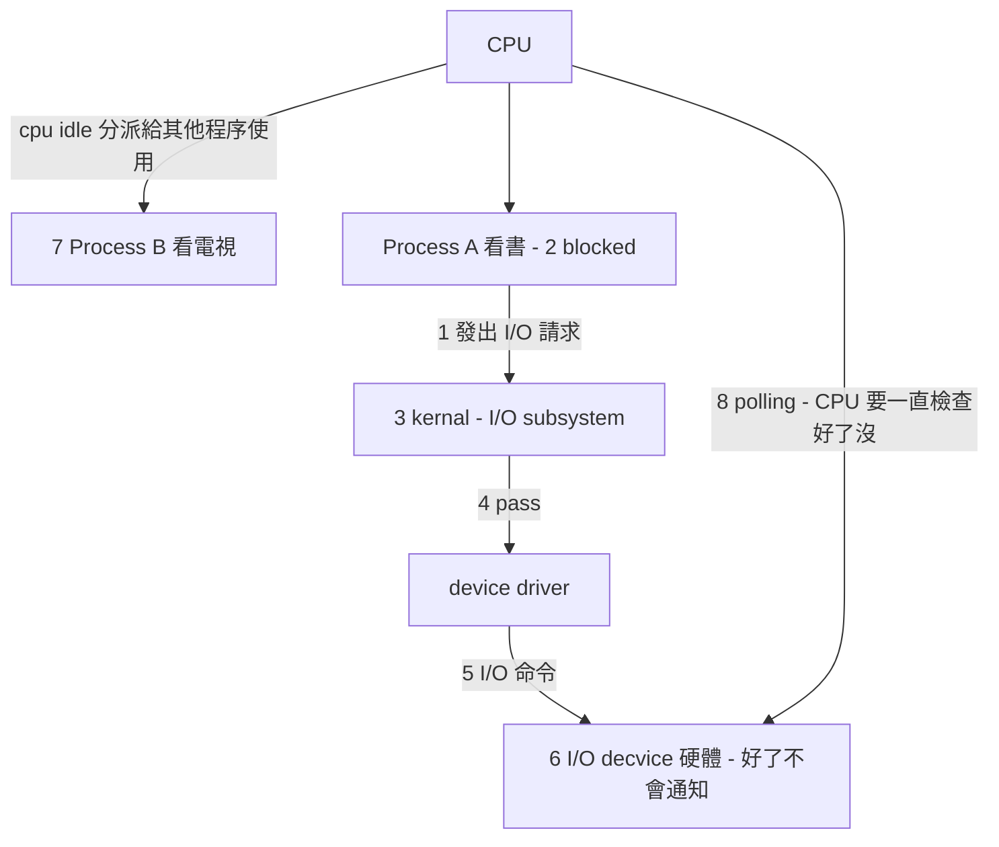
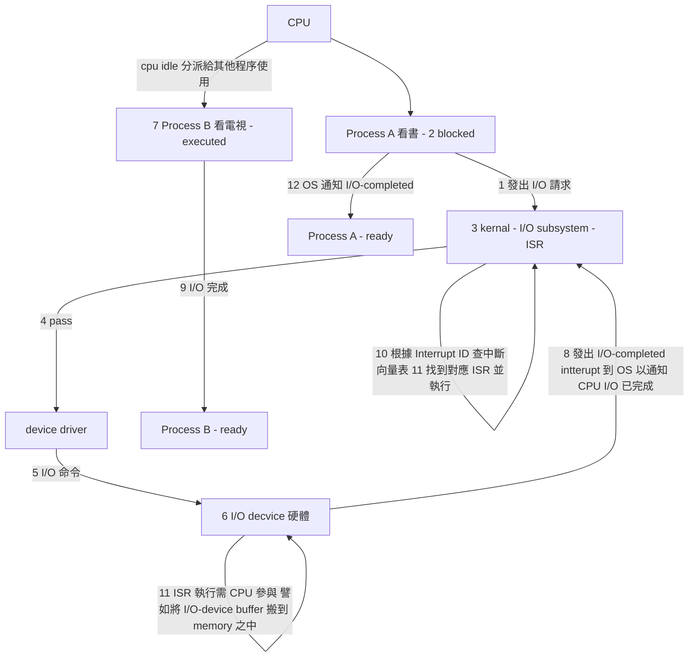

## IO 運作方式: Interrupt 介紹、HW Resource protection

### I/O 運作方式

#### polling I/O (programmed I/O)
  
Def: 又叫 Busy waiting I/O 或 programmed I/O

步驟如下:

1. 執行中的 Process，發出 I/O request 給 OS 希望 OS 提供某種 I/O 服務，eg Disk read a file。
2. OS 收到請求後(可能)會先暫停(block)該 process 即此 process 會放 CPU 至於 waiting queue 等待 I/O completed。
3. OS (or Kernel) 中的 I/O-subsystem 會處理此請求。eg 也會檢查 Disk cache 是否有命中，若有剛從 Disk cache 取出 file 資料 不用 read I/O。
4. I/O-subsystem 會 pass 此請求給 device driver(驅動程式)。
   driver -( request I/O subsystem )-> OS
5. device driver 會依此請求設定相關 I/O commands 到 device controller(硬體)。
6. device controller  會指揮 I/O-device 執行 I/O 運作
7. 此時 CPU 可能 idle，OS 可能會將 CPU 分派給其他 process 使用。
   [怎麼知道設備到底完成了沒有?]
8. CPU 會不斷地去 polling I/O-device controller 上之相關 registers 值，確定 I/O 運作完成與否或有無 error。
 
缺點: 本希望 CPU 專心 process，但 CPU 並未將全 time 用於此 process exec 上而是耗費大量時間去 polling IO-device controllers。
所以 CPU utilization 不高，且 process throughput 偏低。





#### Interrupted I/O

8. 當 I/O 運作完成，I/O-device controller 會發出一個 "I/O-completed" interrupt 通知 CPU(OS)
9. OS 收到中斷通知後(可能)會先暫停目前執行中的 process(eg. PB execution -> ready state)
10. OS 會依 Interrupt ID(No) 查詢 Interrupt vector(表) 找出中斷對應的服務處理程式(ISR: interrupt service routine) 之位址。
11. Jump to ISR 位址，ISR 執行(eg. 將 File Data 從 Controller 之 buffer registers 搬到 memory 中)
12. ISR 完成，控制權交回 kernel I/O-subsystem 通知 process 其 I/O completed 以及告知結果。
13. OS 恢復中斷之前 process 的執行(eg Process B exec) 或交由 cpu schedule 決定下一執行之 process。




優點: 

CPU 無需花費時間用於 polling I/O device controller，而是可以全心用於 Process 之 execution 上。所以 CPU utilization 較高， throughput 相對地較高故 improve the system performance。

缺點: 

* Interrupt 之處理仍需耗費 cpu time (eg 查表.執行 ISR 保存中斷前 process 之 state etc)
* 

#### DMA

#### Interrupt 之處理

Def: DMA controller 負責 I/O-Device 與 memory 之間的 Data transfer 工作。此 transfer 過程不須 cpu 參與。

所以 CPU 有更多時間用於 process exec 上。
另外 DMA 適合用在 block-transfer oriented I/O Device。例如 Disk。
note: 可以降低 I/O completed 中斷頻率。不適合 Byte transfer oriented、character transfer oriente。

缺點: 引入 DMA controller 必須與 CPU 競爭 memory 及 bus 使用權。(需有一硬體協調設計機制，此技術叫 interleaving 或 cycle stealing)

有時 cpu 會被迫等待 DMA when it make use of memory bus.

machine instruction cycle 

``` baah
  抓指令    解碼     執行     x轉存器，記憶體抓   write back
|   IF   |   DE   |   EXE   |        MEM        |     WB    | :storage
   必須     不用      不用          可能            可能      :是否要去 memory access
  有衝突     無       無           無/有           無/有     :DMA目前在使用 memory/也要用
```
ir 指令暫存器 
alu ← signal 通知

當 conflict 時，通常給 DMA 高優先權。

理由: DMA 對 memory、bus 上使用頻率低於 cpu 很多，優先配給 DMA (給需求量少的人)會有比較小的平均 waiting time 及較高之產出(throughput)。


#### 種類

### Interrupt 介紹

#### HW Resource Protection

#### 基礎

##### Daul mode 運作

##### privileged instructions

#### I/O

#### memory

#### cpu